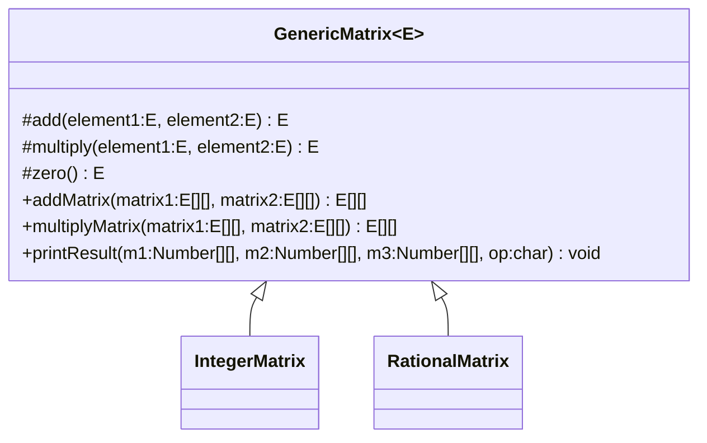

```mermaid
classDiagram
    direction BT
    class GenericMatrix~E~{
        #add(element1:E, element2:E)E
        #multiply(element1:E, element2:E)E
        #zero()E
        +addMatrix(matrix1:E[][], matrix2:E[][])E[][]
        +multiplyMatrix(matrix1:E[][], matrix2:E[][])E[][]
        +printResult(m1:Number[][], m2:Number[][], m3:Number[][], op:char)void
    }

    class IntegerMatrix
    class RationalMatrix

    IntegerMatrix --|> GenericMatrix~E~
    RationalMatrix --|> GenericMatrix~E~
```